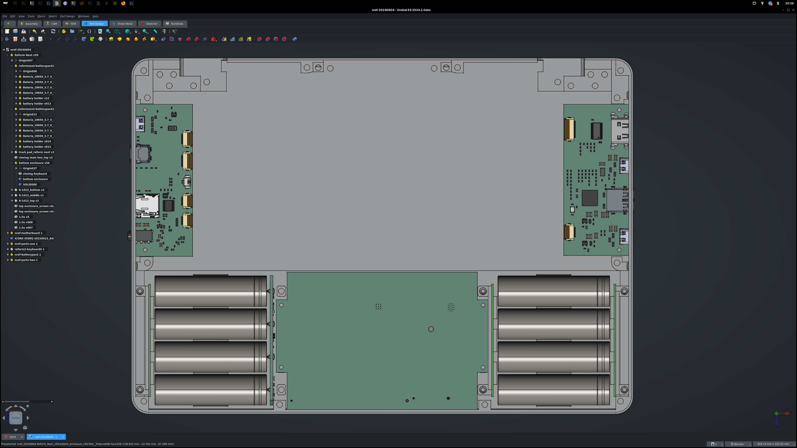

# MNT Reform Next

The original Open Hardware laptop, reloaded.

## Modular Concept

MNT Reform Next takes the MNT Reform family's modular approach a few steps further: The motherboard doesn't have any exterior ports, instead it breaks out all important signals in groups to FPC and JST-SH headers. The connectivity to the outside is implemented via user-exchangable Port Boards that increase repairability, customizability and future proofing of interfaces. The motherboard provides the system controller (RP2040 based), main (multi chemistry) LiFePO4/LiIon charger buck/boost controller, main 5V and 3V3 power rails and the SOM (Processor Module) interface, as well as a 4-lane PCIe M.2 connector for fast NVMe performance.

## Motherboard

Status: Version D-1 (code named "Reflex") designed, soldered, brought up on 2024-06-21.

Internal connectors:

- USB3+2 to Port Board One
- USB3+2 to Port Board Two
- 1 GBit Ethernet
- SD Card (4-bit)
- I2S Audio
- HDMI
- Display Power and Backlight PWM
- Serial UART for Debug
- Power Interface incl. I2C (for USB-C PD or direct power)
- 2x redundant/parallel Battery Packs (Power, Alert and I2C)
- Internal Keyboard Ports (USB and UART for standby mode)

Additional Features:

- RP2040 system controller
- 4-lane PCIe M.2 connector for NVMe
- RGB status LED
- 8-position DIP switch with several configuration options:
  - Power Override: Power on regardless of system controller output (useful for bringup without firmware)
  - Select battery chemistry/charge voltage (LiFePO4/LiIon)
  - Switch RP2040 USB to either SOM or external port for flashing
- USB2.0 hub
  - to provide enough internal USB2.0 ports for input devices and RP2040 communication

Power System:

- BQ25756 multi-chemistry charge buck/boost controller for 4S2P LiFePO4 or 4S2P LiIon batteries
- LM62460 for 6A of 5V power
- LM62460 for 6A of 3.3V power
- MAX1837EUT33+T for Standby 3v3 power

All main power rails work, and i.MX8MPlus Reform Processor module was used to boot Linux, which was operable via serial console (UART 2):

The system idles with only 2.3W power draw with the i.MX8MPlus module, meeting or power efficiency goals.

Motherboards physically fits in the prototype 3D printed case from december 2023:

## Processor Modules

MNT Reform Next supports a [variety of Processor Modules](https://mntre.com/modularity.html). The standard module is the RCORE with 8-core Rockchip RK3588 processor and Mali G610 GPU: https://source.mnt.re/reform/mnt-reform-rk3588-som/#mnt-reform-rcore-rk3588-som

## Port Boards

3 in total: Left, Right and Back sides:

- Standard Port Board One:
  - USB-C with USB3+2 signalling and USB Power Delivery
  - 1 GBit Ethernet (currently iX Industrial, low-profile RJ45 being explored)
  - MicroSD slot
  - TLV320AIC3100 Soundchip with internal speaker driver/connector
  - Headset TRRS jack (stereo headphone driver and mono microphone support)
- Standard Port Board Two:
  - Full-size HDMI
  - 2x USB-C with USB3+2 signalling
  - 1x USB-A with USB3+2 signalling for legacy USB devices
- Standard Port Board Three:
  - WIP

Status:

- Version D-1 of Port Board One designed and ordered, to be brought up 2024-06-24.
- Port Board Two schematics completed, to be routed. TODO: USB connector for optional internal camera.
- The back-facing Port Board Three is in schematics development. It will feature the internal display connector/bridge and mounting space for internal or external antennas.

## Battery Packs

WIP. The redundant battery packs have their own monitoring and balancing circuit and abstract everything digitally over I2C.

## Case

The case has passed several revisions but is still evolving. Most features are placed, except for speaker and optional camera.

The case bottom integrates grooves to hold 8x 18650 batteries split into two parallel packs.

## Mechanical Keyboard

WIP. The keyboard is an evolution/redesign of MNT Reform Keyboard V3 and integrates Pocket Reform features like RGB backlight and upgraded controller (RP2040). Keyswitches are Kailh Choc and keycaps are customized MBK Glows by FKcaps.

## Trackpad

WIP. The trackpad is an evolution of the multitouch glass trackpad option for classic MNT Reform.

## Credits (So Far)

- Ana Dantas: Industrial Design
- Lukas "minute" Hartmann: Motherboard, Keyboard, Ports, Etc.
- Elen Eisendle: Battery Pack

## Copyright

All hardware design work in this repository is © 2024 [MNT Research GmbH](https://mntre.com), Berlin, Germany, and contributors (see Credits).

## License

All hardware sources are licensed under the [CERN Open Hardware Licence Version 2 - Strongly Reciprocal](https://ohwr.org/project/cernohl/wikis/uploads/002d0b7d5066e6b3829168730237bddb/cern_ohl_s_v2.txt).

## Funding

This project [receives funding by NLNet](https://nlnet.nl/project/MNT-Reform-Next/).
