# MNT Reform Next

The original Open Hardware laptop, reloaded.

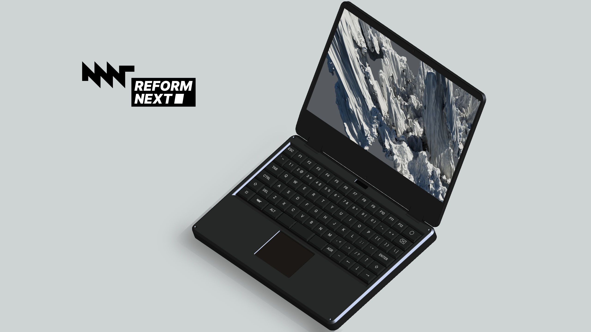

## Modular Concept

MNT Reform Next takes the MNT Reform family's modular approach a few steps further: The motherboard doesn't have any exterior ports, instead it breaks out all important signals in groups to FPC and JST-SH headers. The connectivity to the outside is implemented via user-exchangable Port Boards that increase repairability, customizability and future proofing of interfaces. The motherboard provides the system controller (RP2040 based), main (multi chemistry) LiFePO4/LiIon charger buck/boost controller, main 5V and 3V3 power rails and the SOM (Processor Module) interface, as well as a 4-lane PCIe M.2 connector for fast NVMe performance.

## Motherboard

Status: Version D-1 (code named "Reflex") designed, soldered, brought up on 2024-06-21.

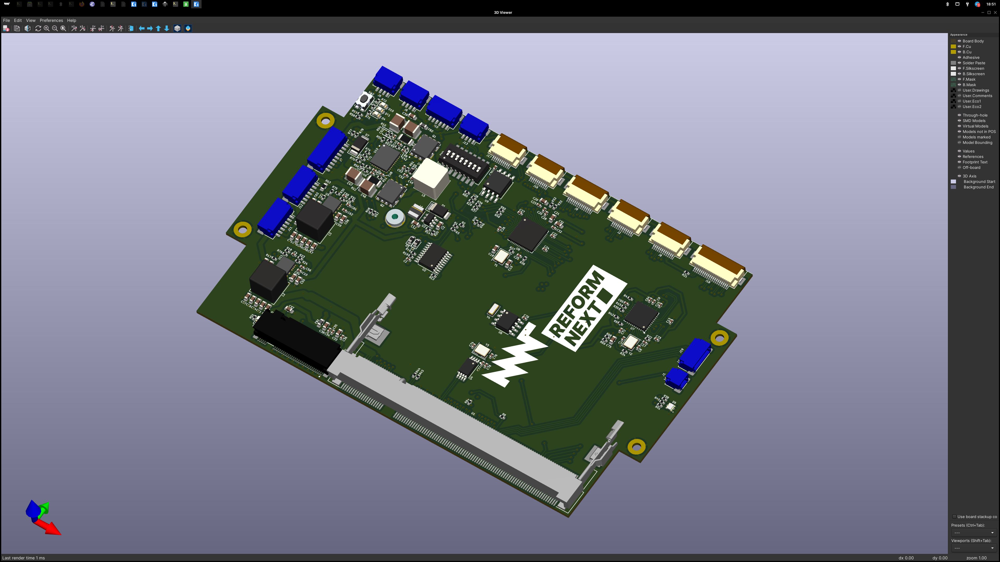
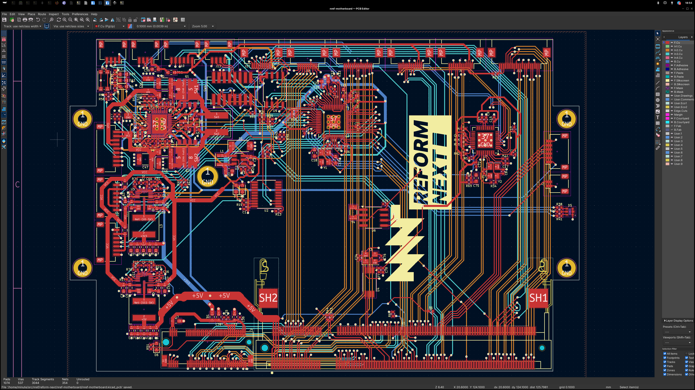

Internal connectors:

- USB3+2 to Port Board One
- USB3+2 to Port Board Two
- 1 GBit Ethernet
- SD Card (4-bit)
- I2S Audio
- HDMI
- Display Power and Backlight PWM
- Serial UART for Debug
- Power Interface incl. I2C (for USB-C PD or direct power)
- 2x redundant/parallel Battery Packs (Power, Alert and I2C)
- Internal Keyboard Ports (USB and UART for standby mode)

Additional Features:

- RP2040 system controller
- 4-lane PCIe M.2 connector for NVMe
- RGB status LED
- 8-position DIP switch with several configuration options:
  - Power Override: Power on regardless of system controller output (useful for bringup without firmware)
  - Select battery chemistry/charge voltage (LiFePO4/LiIon)
  - Switch RP2040 USB to either SOM or external port for flashing
- USB2.0 hub
  - to provide enough internal USB2.0 ports for input devices and RP2040 communication

Power System:

- BQ25756 multi-chemistry charge buck/boost controller for 4S2P LiFePO4 or 4S2P LiIon batteries
- LM62460 for 6A of 5V power
- LM62460 for 6A of 3.3V power
- MAX1837EUT33+T for Standby 3v3 power

All main power rails work, and i.MX8MPlus Reform Processor module was used to boot Linux, which was operable via serial console (UART 2):

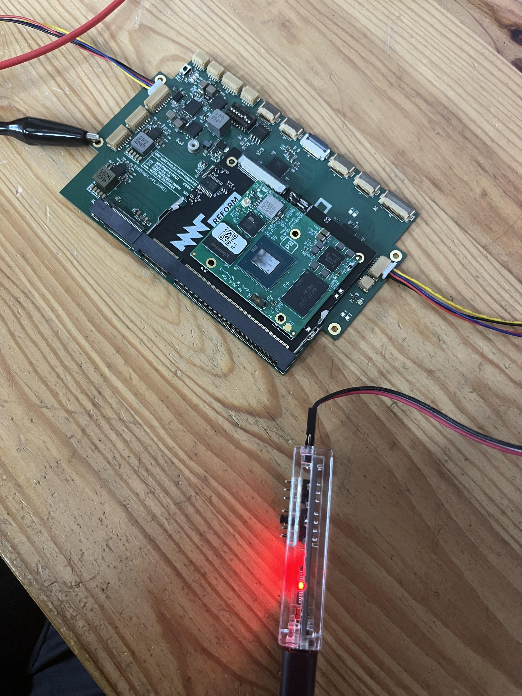
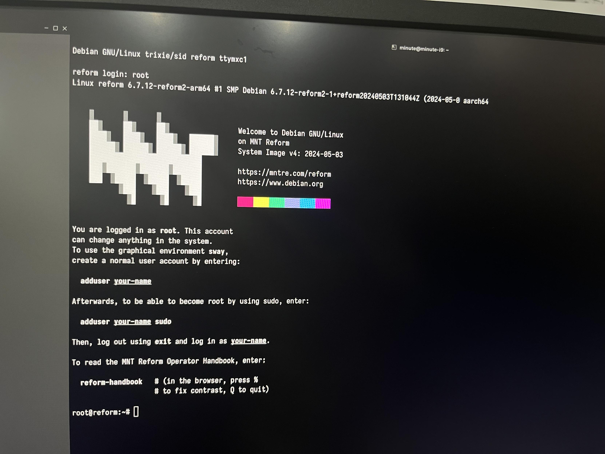

The system idles with only 2.3W power draw with the i.MX8MPlus module, meeting or power efficiency goals.

Motherboards physically fits in the prototype 3D printed case from december 2023:

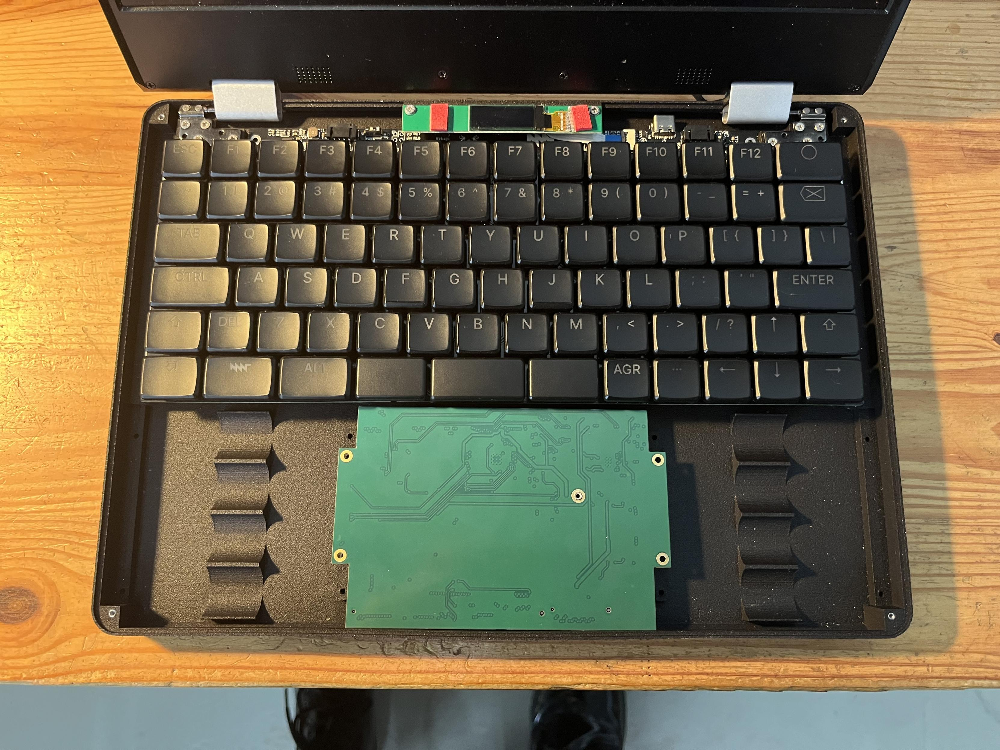

## Processor Modules

MNT Reform Next supports a [variety of Processor Modules](https://mntre.com/modularity.html). The standard module is the RCORE with 8-core Rockchip RK3588 processor and Mali G610 GPU: https://source.mnt.re/reform/mnt-reform-rk3588-som/#mnt-reform-rcore-rk3588-som

## Port Boards

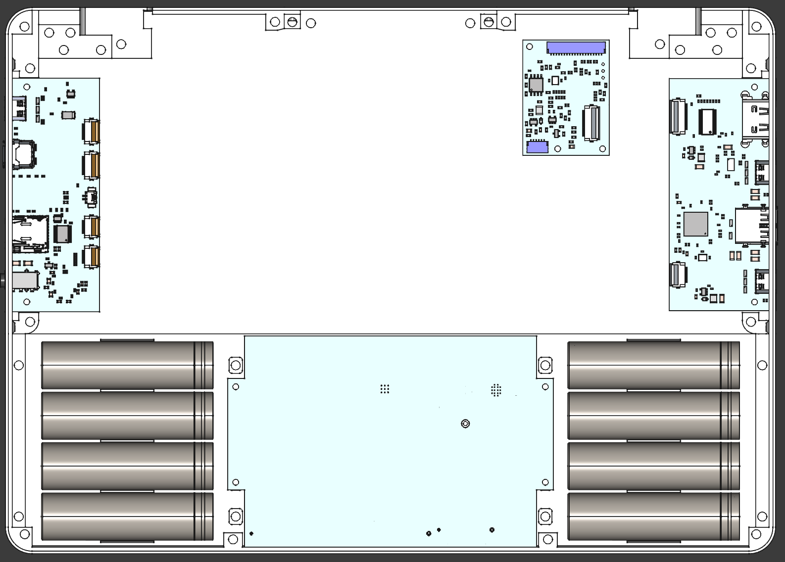

3 in total: Left, Right and Back sides:

- Standard Port Board One:
  - USB-C with USB3+2 signalling and USB Power Delivery
  - 1 GBit Ethernet (ix Industrial. Device will be shipped with a short ix to RJ45 jack dongle.)
  - MicroSD slot (bootable)
  - TLV320AIC3100 Soundchip with internal speaker driver/connector
  - Headset TRRS jack (stereo headphone driver and mono microphone support)
- Standard Port Board Two:
  - Full-size HDMI
  - 2x USB-C with USB3+2 signalling
  - 1x USB-A with USB3+2 signalling for legacy USB devices
- Standard Port Board Three:
  - WiFi/BT chipset and antennas

### Port Board One Dimensions / Specs

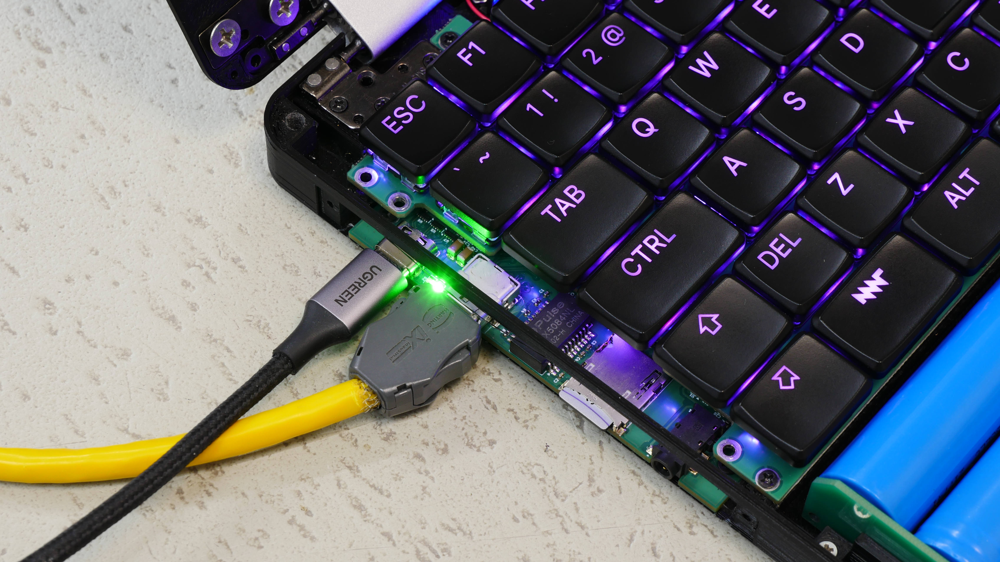

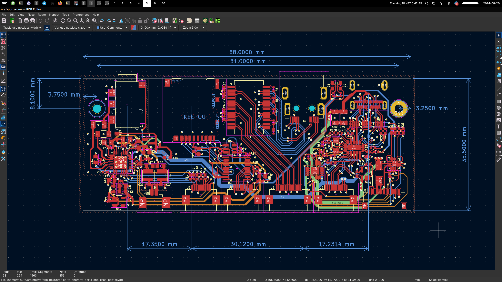

Port Board One is mounted on the left side of the case and is responsible for USB-C Power Delivery. When customizing this board, this functionality must be retained for powering the laptop. Copy the KiCAD source files as a starting point. There is a mechanical/spatial coupling with the keyboard that rests above the ports. Please take a look at the following drawing to see where the keyboard PCB is cut away. This defines the space that is available for ports. Any parts and connectors should not be taller than x mm above a 1.6mm PCB, because keycaps could collide with the components when being pressing down.

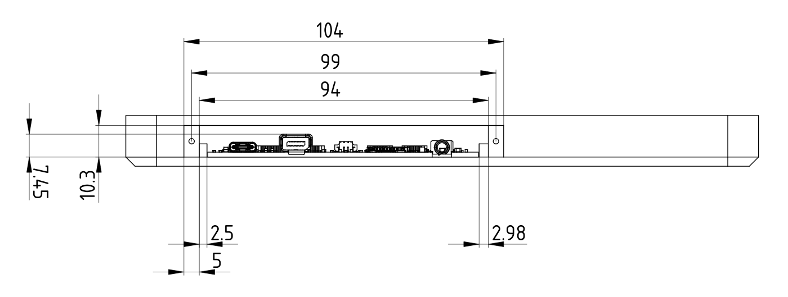

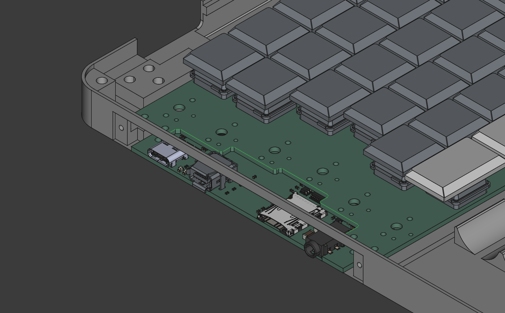

The electrical interfaces normally available to the left side are:

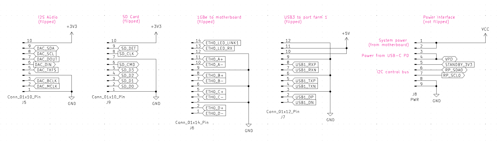

### Port Board Two Dimensions / Specs

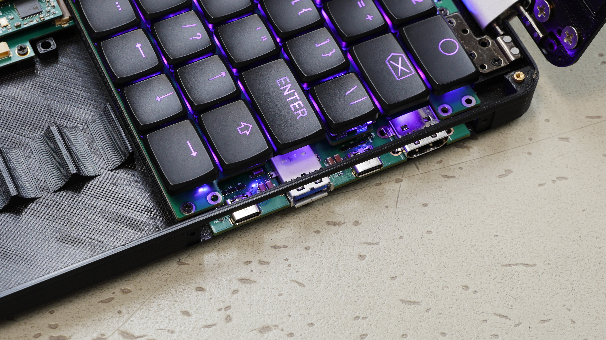

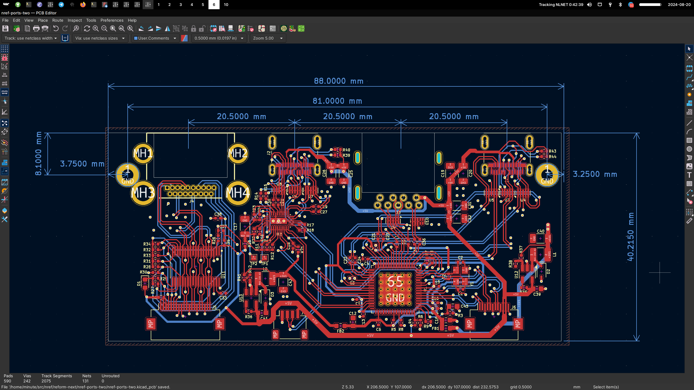

Port Board Two is mounted on the right side of the case and mainly provides USB connectivity (3 ports), plus HDMI. Copy the KiCAD source files as a starting point. A similar mechanical/spatial coupling with the keyboard as with the Port Board One constrains the port placement, see the following drawing.

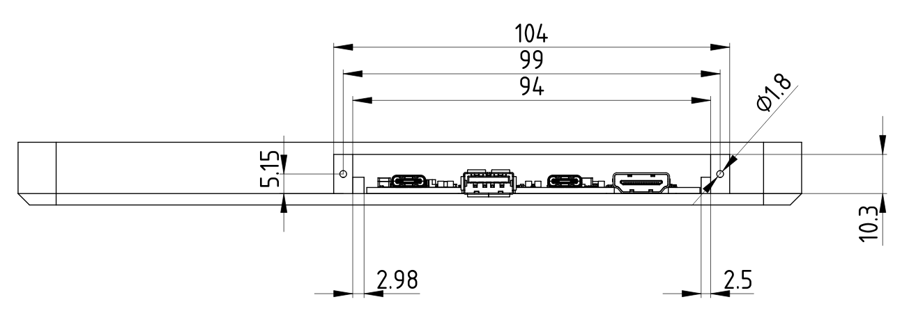

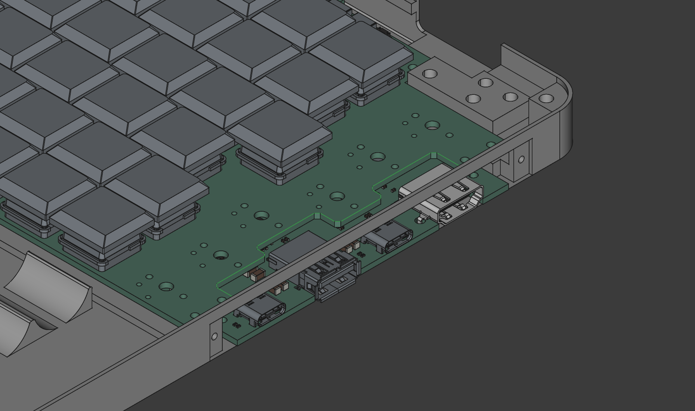

The electrical interfaces normally available to the right side are:

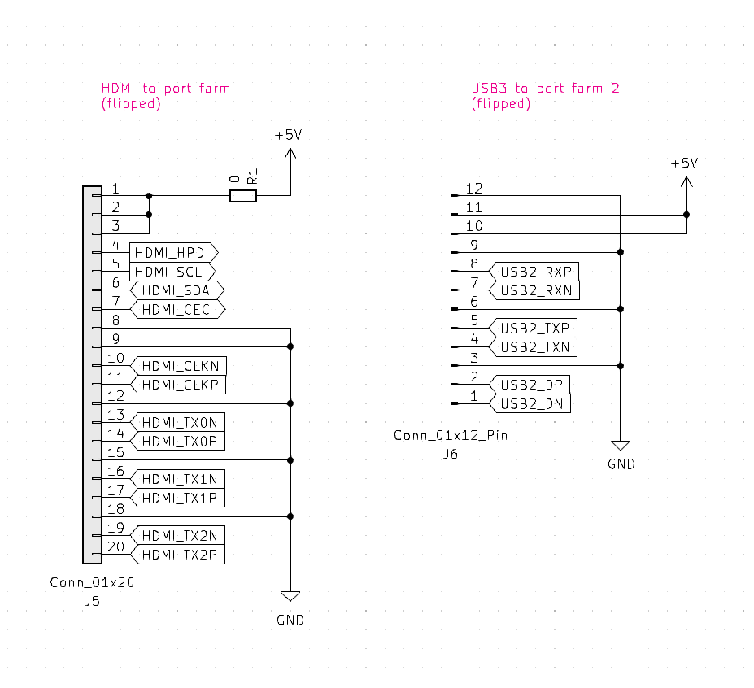

### Port Board Three Dimensions / Specs

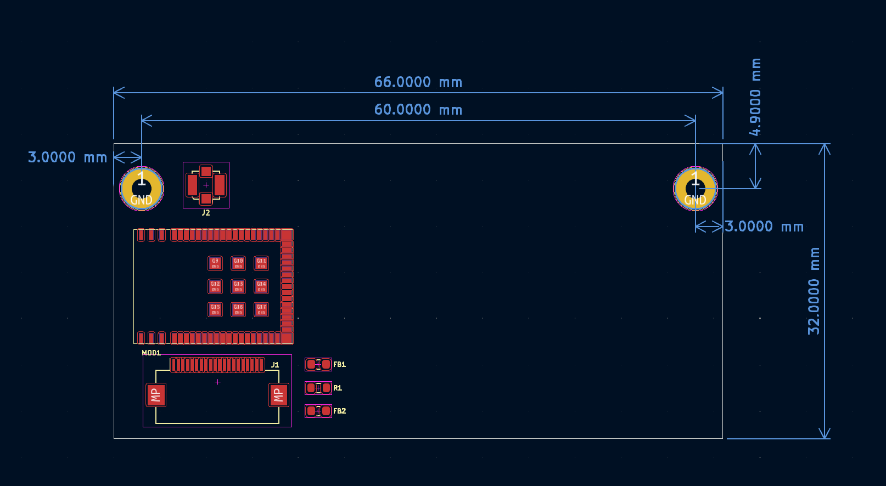

Port Board Three hosts a WiFi/BT chipset by default. It receives USB2, SDIO and UART (with flow control) signals as well as 5V and 3V3 power from Processor Modules that support this (like the RCORE RK3588 module).

The default WiFi/BT implementation is based around the Ezurio Sterling-LWB5+ WiFi 5 with Bluetooth 5.2 SMT module. The chipset is Cypress CYW4373EUBGT, which has good Linux mainline driver support.

By default, this board doesn't expose any connectors to the outside. Instead, WiFi/BT antennas are mounted on it, and the port cover is made from an RF transmissive material to allow for good reception. But you can customize this board while making use of the available space under/behind the keyboard to add external ports, like external antenna connectors, or back-facing USB.

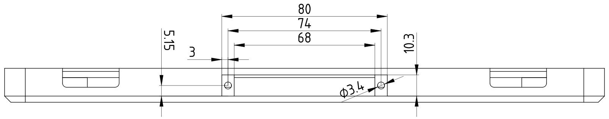

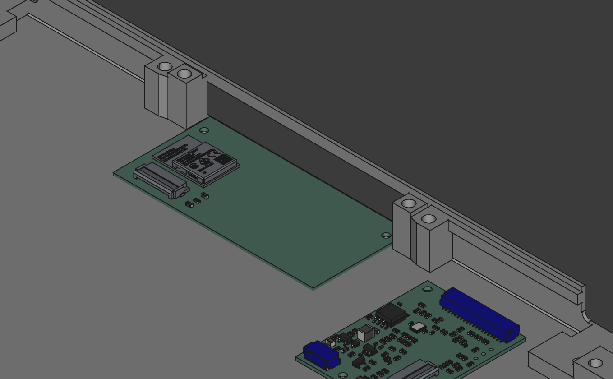

The electrical interfaces normally available to the back side are:

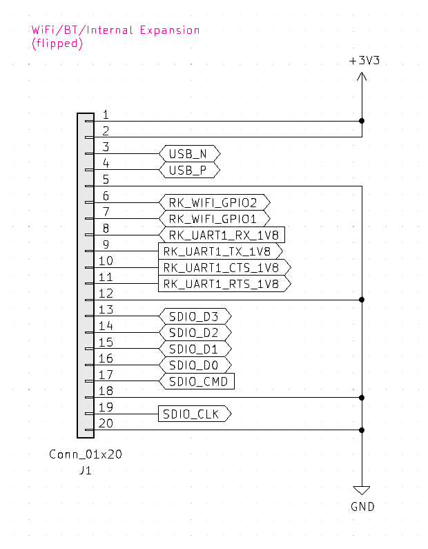

### Area Below the Keyboard

You have up to four millimeters of vertical space below the keyboard for extending port boards with low-profile components. 1mm or 0.8mm thick PCBs are recommended. You can also create boards that splice/transform/forward available FFC signals, such as USB (with hubs), I2C (with extenders), Ethernet (switch), etc. as long as they fit under the keyboard. There is some more space available between the through-hole pin rows of the keyboard. It is recommended to load your design as a STEP model into the provided FreeCAD laptop assembly file to check for any mechanical interference.

## Battery System

In Reform Next, the battery packs have 4 user replacable 18650 cells in series each. The packs are connected to the motherboard in parallel, so they are fully redundant. They have their own monitoring and balancing circuits and abstract all measurements like cell voltages, current, and alert states digitally over I2C. The main buck/boost charger resides on the motherboard. The coordination of the packs, the charger, and the USB-C power delivery living on Port Board one are implemented centrally in free software running on the RP2040 microcontroller on the motherboard. The default chemistry of the cells is LiFePO4. The chemistry can be switched to LiIon using DIP switches on the motherboard--this optional user choice trades longer runtime for less safety and environmental friendliness.

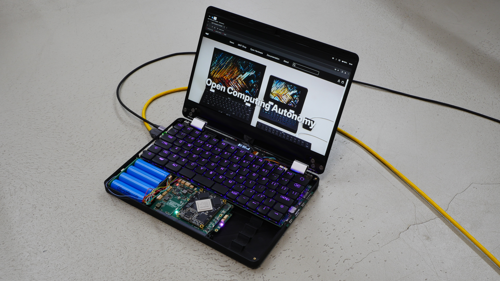

At the current state of development, the laptop successfully runs a Linux Wayland desktop from a single or two inserted battery packs. The small OLED display on top of the keyboard can show individual cell voltages and system voltage as well as dis/charging current.

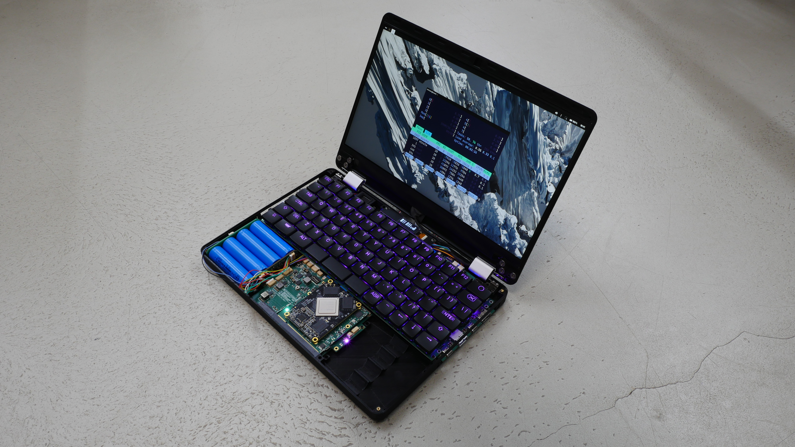

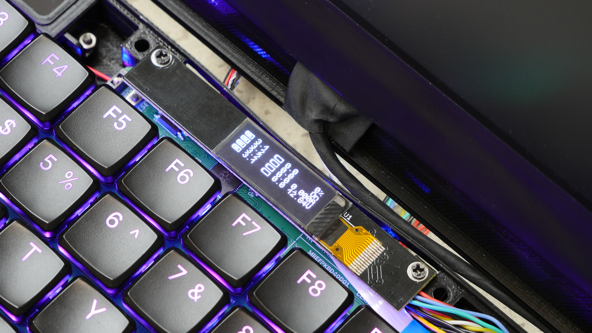

The battery packs can be charged via USB-C power delivery from a off-the-shelf charger using the USB-C port on the left of the device.

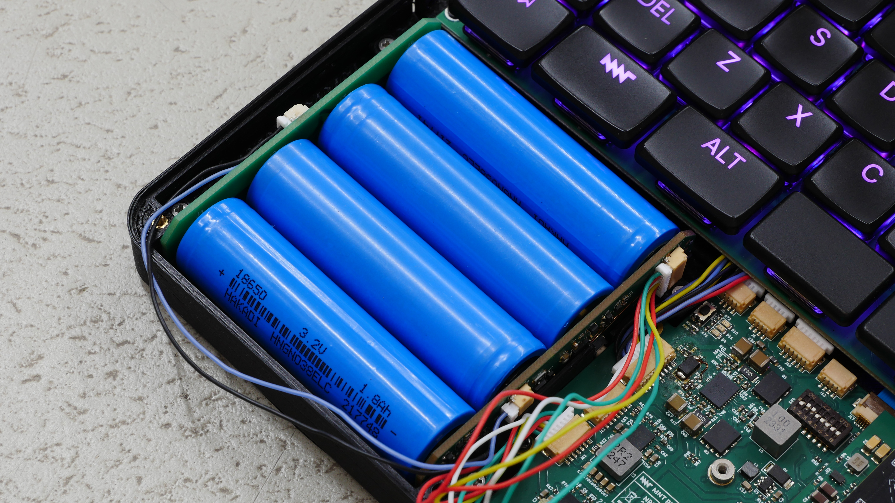

## Case

The case has passed several revisions but is still evolving. Most features are placed, except for speaker and optional camera.

The case bottom integrates grooves to hold 8x 18650 batteries split into two parallel packs.

## Mechanical Keyboard

The keyboard is an evolution/redesign of MNT Reform Keyboard V3 and integrates Pocket Reform features like RGB backlight and upgraded controller (RP2040). Keyswitches are Kailh Choc and keycaps are customized MBK Glows by FKcaps.

## Trackpad

WIP. The trackpad is an evolution of the multitouch glass trackpad option for classic MNT Reform.

## Credits (So Far)

- Ana Dantas: Industrial Design
- Lukas "minute" Hartmann: Motherboard, Keyboard, Ports, Etc.
- Elen Eisendle: Battery Pack

## Copyright

All hardware design work in this repository is © 2024 [MNT Research GmbH](https://mntre.com), Berlin, Germany, and contributors (see Credits).

## License

All hardware sources are licensed under the [CERN Open Hardware Licence Version 2 - Strongly Reciprocal](https://ohwr.org/project/cernohl/wikis/uploads/002d0b7d5066e6b3829168730237bddb/cern_ohl_s_v2.txt).

## Funding

This project [receives funding by NLNet](https://nlnet.nl/project/MNT-Reform-Next/).
